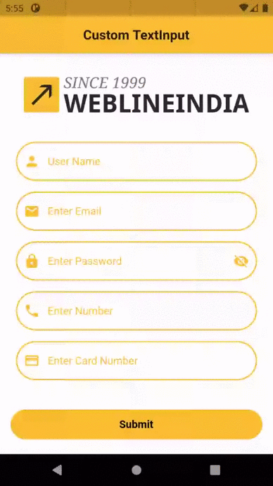

# Flutter - Custom TextInput

A Flutter based Reusable component which provides TextInput with custom properties which can be used in any Flutter application.

## Table of contents
- [Flutter Support](#flutter-support)
- [Demo](#demo)
- [Features](#features)
- [Getting started](#getting-started)
- [Usage](#usage)
- [Methods](#methods)
- [Want to Contribute?](#want-to-contribute)
- [Need Help / Support?](#need-help)
- [Collection of Components](#collection-of-Components)
- [Changelog](#changelog)
- [License](#license)
- [Keywords](#Keywords)

## Flutter Support

Version - Flutter 1.17 (stable)

We have tested our program in above versions, however you can use it in other versions as well.

## Demo

------

## Features

* Customisable TextInput with more properties.

* Common widget can be used for different textinput based on Type.

1) Default TextInput

2) Email TextInput

3) Password TextInput

4) Phone TextInput

5) CreditCard TextInput.

## Getting started

* Download this sample project and import custom_text_input.dart file in your project.. 
* Update Widgets UI based on your requirements. 

## Usage

Setup process is described below to integrate in project.

### Methods

Configure CustomTextInput Widget 
      
    // Put CustomTextInput Widget
    CustomTextInput(
     
    )
       
    
Pass required properties
    
    // add text edit controller, hint text and input type
    // textEditController used to fetch text from textInput
    // hintTextString is used to show hint and used as a label
    // inputType is used to identify which type of TextInput you needed, On basis of that you will get multiple properties and validations
    CustomTextInput(
      textEditController: _textController,
      hintTextString: 'Enter Email',
      inputType: InputType.Email,
    )

      
Available InputTypes

      //required parameter to identify type of TextInput
      InputType.Default
      InputType.Email
      InputType.Number
      InputType.Password
      InputType.PaymentCard
   

Set below properties based on your requirements                  
       
    //optional property for enable border outside the textinput field
    //it accepts boolean value, default value will be true
    enableBorder: true,
    
    //optional property set theme color
    //It will change border color and label color
    //it accepts Color object, default value will be theme's primary color
    themeColor: Theme.of(context).primaryColor,
    
    //optional property for set corner radius
    //with this you can make rounded border as well as curve
    //it accepts double value, default value will be 12.0
    cornerRadius: 48.0,
    
    //optional property for set maximum character allows
    //it accepts int value, default will be based on textinput type
    maxLength: 24,
    
    //optional property for set prefix icon
    //it accepts widget, default will be icon based on textinput type
    //you can set color of icons as well through color property of icon
    prefixIcon: Icon(Icons.person, color: Theme.of(context).primaryColor),
    
    //optional property for set text color
    //it accepts color object, default will be Theme's primary color
    textColor: Colors.black,
    
    //optional property for set customize error message
    //it accepts string, default will be based on textinput type
    errorMessage: 'User name cannot be empty',
    
    //optional property for set label name
    //it accepts strings, default will be hint string
    //this label will show when textinput animated while writing
    labelText: 'User Name',

------

## Want to Contribute?

- Created something awesome, made this code better, added some functionality, or whatever (this is the hardest part).
- [Fork it](http://help.github.com/forking/).
- Create new branch to contribute your changes.
- Commit all your changes to your branch.
- Submit a [pull request](http://help.github.com/pull-requests/).

------

## Need Help? 
If you need help then feel free to contact our [Flutter developers](https://www.weblineindia.com/flutter-cross-platform-mobile-app-development.html).

 ------
 
## Collection of Components
 We have built many other components and free resources for software development in various programming languages. Kindly click here to view our [Free Resources for Software Development.](https://www.weblineindia.com/communities.html)
 
------

## Changelog
Detailed changes for each release are documented in [CHANGELOG](./CHANGELOG).

## License

[MIT](LICENSE)

[mit]: https://github.com/weblineindia/Flutter-TextInput/blob/master/LICENSE

## Keywords
Flutter TextInput, Flutter Customisable TextField, Custom TextInput, Reusable TextField, Weblineindia
